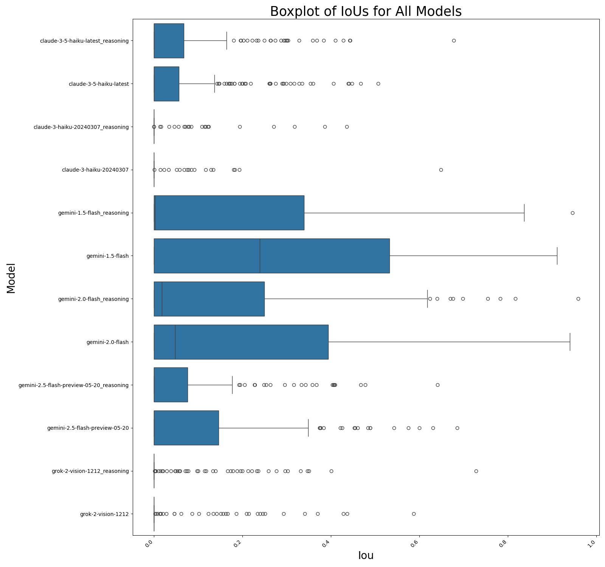
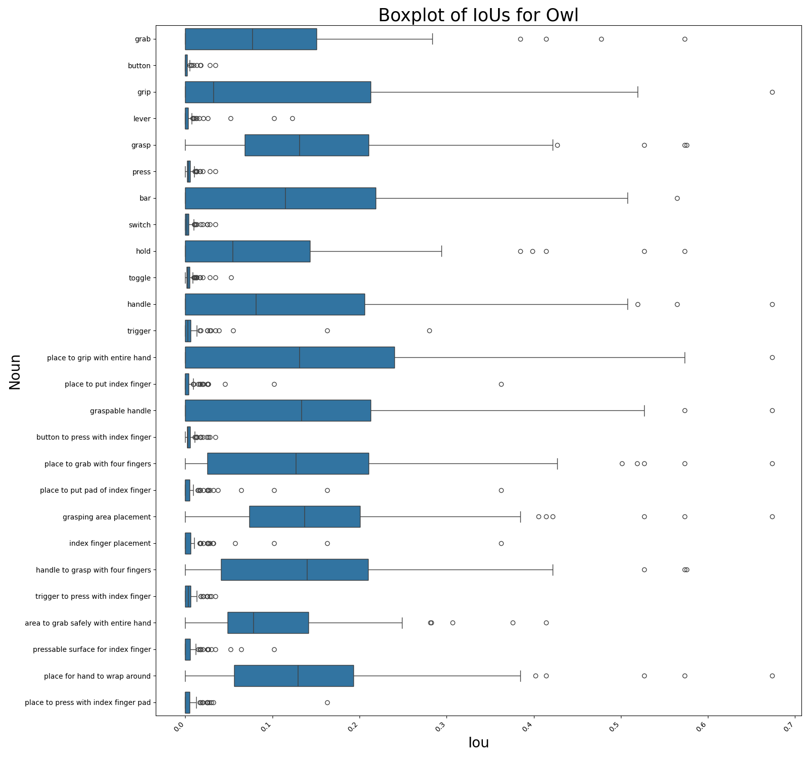

Grasp VLM Prediction  
The goal is to see how vlms can produce bounding boxes for finger placements on tools. 
Results so far:  
  
  
For owl, I experimented with prompting nouns, specifically with single word prompts vs. descriptive prompts.  
The dataset has 200 images and there are two main classes: index finger objects and four finger grasp objects.  
For index finger objects, the agent outputs a bbox for the index finger for grasping. For four finger objects, the agent outputs a bbox for the four fingers that would wrap around the object. Within these two classes, there are many tools.
The tools include:  
Pistol Grip Objects:  
    drill, weed wackers, glue gun, circular saw, nailgun.  
Handle Objects:  
    screwdriver, wrench, soldering tool, allen key, hammer.  
Annotations for Pistol Grip Objects:  
    bounding box for index finger placement.  
    pixel coordinates (x,y) for perfect placement of index finger.  
Annotations for Handle Objects:  
    bounding box for anywhere that is valid to place all 4 fingers.  
    pixel coordinates (x,y) for placements of all 4 fingers.  

